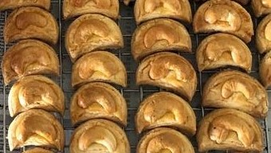

[Back to homepage](https://ah-jia.github.io/)

# CASHEW NUT BISCUIT

## Ingredients
- 200 gm  butter				
- 170 gm  icing sugar			
- 2	egg yolk			
- 400 gm  plain flour		
- 1 tsp   baking powder
- pinch of salt
- 1 tsp   vanilla essence
- cashew nuts 
## Method
1. Sieve the flour, baking powder and salt together.
2. Beat butter and sugar, add egg yolk and vanilla essence.
3. Mix in the flour to form into dough.
4. Roll out and cut into shapes, put a cashew nut on top and glaze with egg.
5. Bake at 175°C for about 15 min.

[Back to homepage](https://ah-jia.github.io/)
